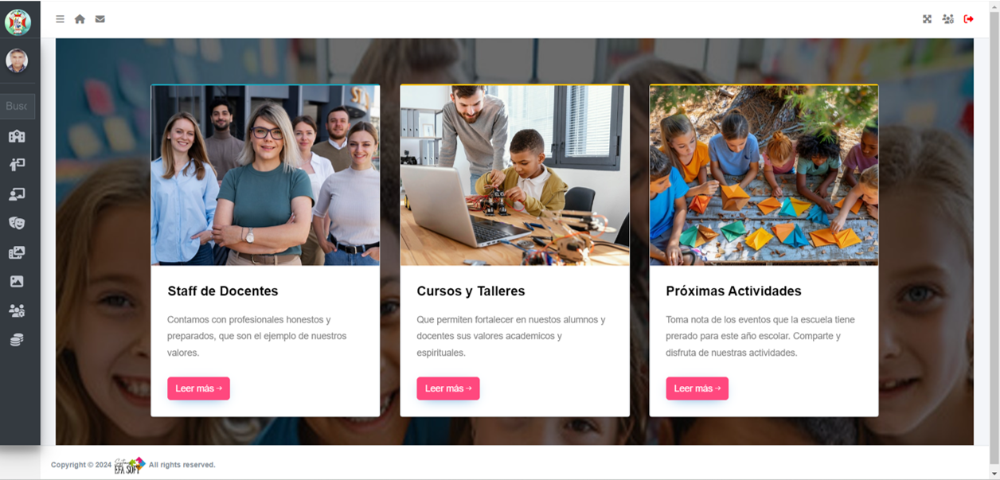

<h3 align="center">soy Desarrollador Front-End y Back-End desde 1987</h3>

 ###### 16/07/2024

> Actualmente trabajo migrando un Sistema Administrativo para una escuela primaria.
<h3 align="center">SIGG-EDU</h3>

- **Nuestro Objetivo**

> Este sistema permitira llevar el control de Alumnos, Representantes, Personal Docente, Administrativo y Obrero. Entre los puntos mas importantes, el sistema brindara información detallada de la cantidad de alumnos por Grado y Sección, generando diversos tipos de listados. Asimismo la asignación de trabajos, actividades que seran accesibles a los representantes.

- **Lenguajes y Herramientas**

###

  
  
  
  
  
  
  
  
  
  
  
  
  
  
  
  
  
  
  
  
  
  
  
  
  

###

  

###
- **Mis Estadísticas**

&nbsp;
